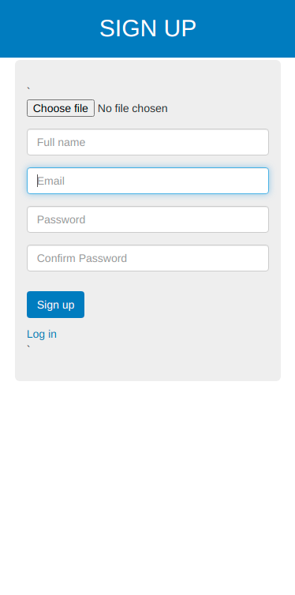
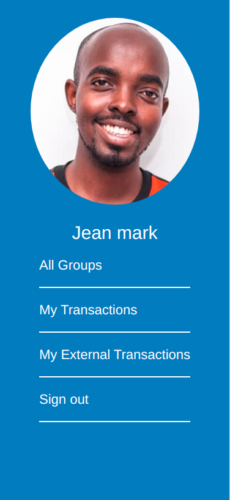
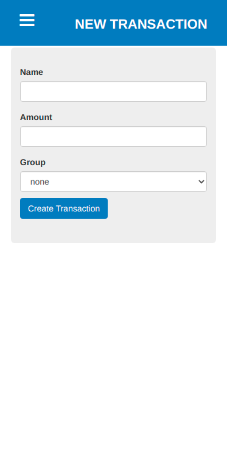

 

# e-wallet-tracker 

> A full stack rails application of a digital tracking mobile first designed website where users can create transactions and opt to group them in particular categories to analyse their expenditure with ease. The features are listed next to the screenshots.

## Live Demo

[Live Demo Link](https://limitless-plains-58858.herokuapp.com/)

## Screenshots

### Authentication, Sign Up & Log In

|  | |
|:---:|:---:|
| Sign Up | Log In |

### User Profile, All Groups, All My Transactions, & All My External Transactions

|  | |  | |
|:---:|:---:|:---:|:---:|
| User Profile | All Groups | All My Transactions | All My External transactions |

### Create New Group, Create New Transaction

|  | |
|:---:|:---:|
| Create New Group | Create New transaction |


## Built With

- Ruby v2.7.0
- Ruby on Rails v6.1.4

## Getting Started

To get a local copy up and running follow these simple example steps.

### Prerequisites

- Ruby: 2.7.2
- Rails: 6.1.4
- Postgres: >=9.5

### Setup

- Follow these instructions to get a local copy up and running
```
git clone https://github.com/KabohaJeanMark/e-wallet-tracker/
cd e-wallet-tracker
```
Instal gems with:

```
bundle install
```

Setup database with:

```
   rails db:create
   rails db:migrate
```

### Usage

Start server with:

```
    rails server
```

Open `http://localhost:3000/` in your browser.

### Run tests

```
    rspec --format documentation
```

### Project Runthrough
#### Sign Up
Authetication s handled by device:

- One can sign up with a valid profile image, username, email address and a password of atleast 6 characters.
- An already signed up user just needs their email and Password to log in.

#### User Profile Page
- After sign up or login, one is directed to their user profile page.
- It contains their profile image and name at the top.
- Profile page has 3 links to the following pages.
- All groups
- All my transactions.(transactions created by logged-in user where the group was specified)
- All my external transactions(transactions created by logged-in user but where no group was specified)

#### All My Transactions
- Total amount is displayed at the top
- A list of all transactions created by logged-in user is displayed (sorted by most recent).
- 2 links to change the sort order. most recent and most ancient at the top.
- Each transaction displays its name, amount and date, and an icon of the first group it has been assigned to.
- An action button "Add new" is displayed.

#### All My External transactions
- A list of all transactions that are created by a logged-in user but **not assigned to any group** (sorted by most recent).
- The design of the page is similar to the "All my transactions".

#### All Groups
- A list of all groups is displayed in alphabetical order.
- Each group displays its icon, name and creation date.
- Each group is clickable and opens "Group transactions" page.
- An action button "Create new" is displayed.

#### Group Transactions
- A list of all transactions that belong to that group is displayed.
- The design of the page is similar to the "All my transactions". Besides the information that appears in All my transactions page, each transaction displays the **name of the author** of the transaction.

## Author

👤 **Kaboha Jean Mark**

- GitHub: [@githubhandle](https://github.com/KabohaJeanMark)
- LinkedIn: [LinkedIn](https://www.linkedin.com/in/jean-mark-kaboha-software-engineer/)

## 🤝 Contributing

Contributions, issues and feature requests are welcome!

Feel free to check the [issues page](https://github.com/KabohaJeanMark/e-wallet-tracker/issues/).

- Checkout to a feature branch and make your commits with descriptive messages here and raise a Pull Request
```
git checkout -b <ft-branch-name>
```

## Show your support

Give a ⭐️ if you like this project!

## Acknowledgments for design credit

The [design](https://www.behance.net/gallery/19759151/Snapscan-iOs-design-and-branding?tracking_source=) idea is by Gregoire Vella and hosted on behance.

## 📝 License

This project is [MIT](./LICENSE) licensed.

